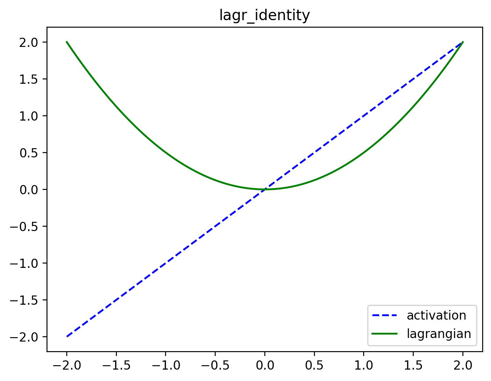
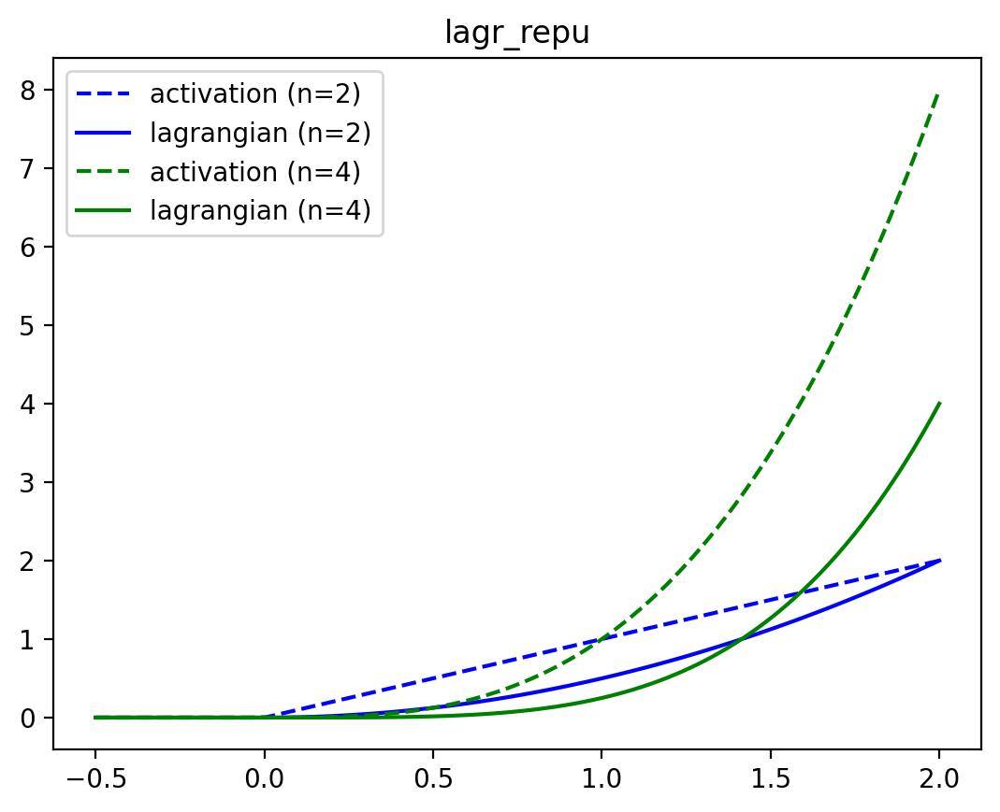
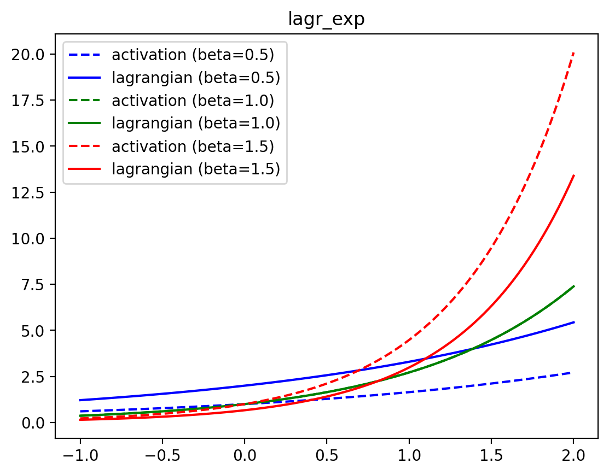
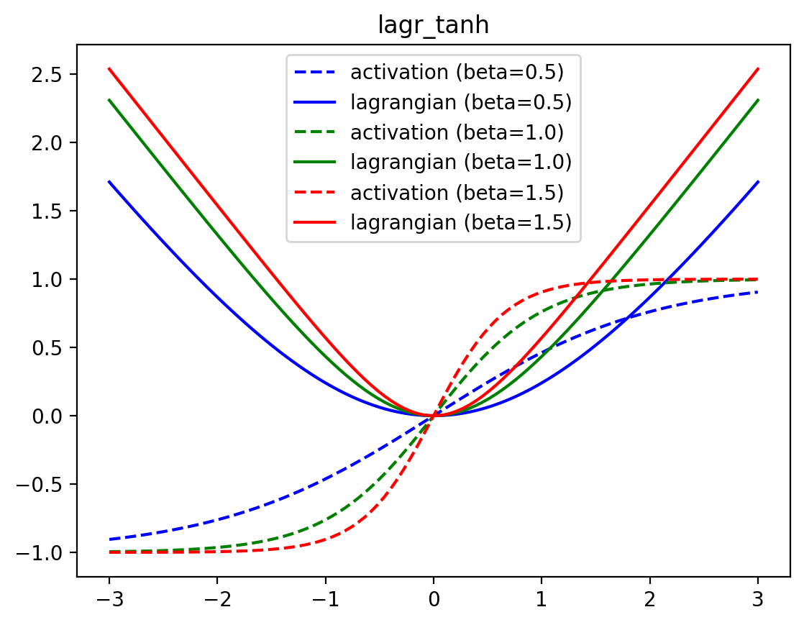
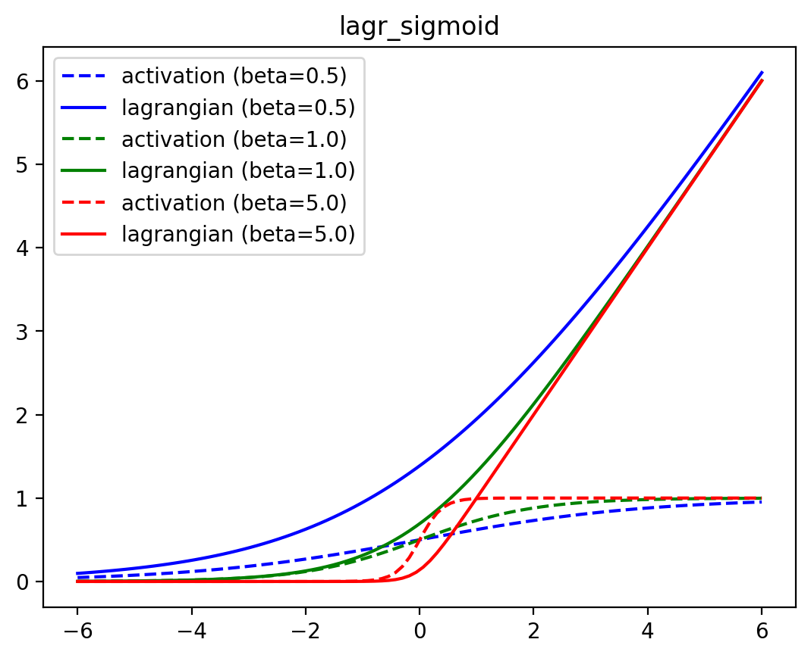
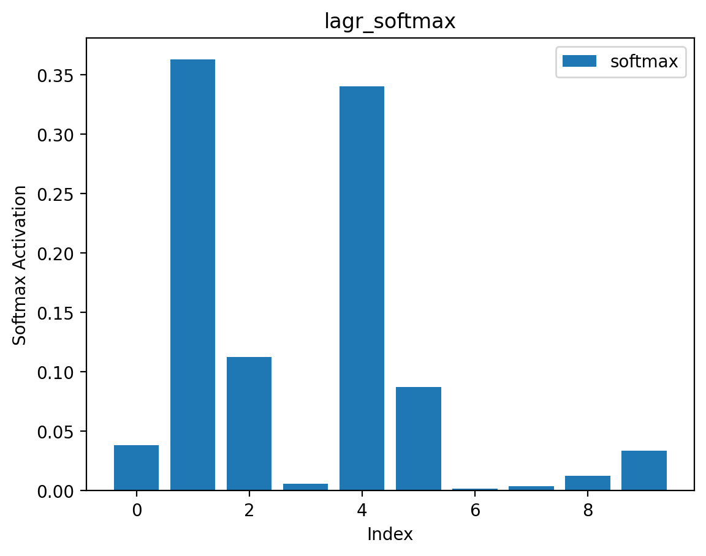

# Lagrangians

<!-- WARNING: THIS FILE WAS AUTOGENERATED! DO NOT EDIT! -->

> **TL;DR**
>
> 1.  All dynamics of Associative Memory are constrained by a Lagrangian
> 2.  The Lagrangian is a convex, scalar-valued function
> 3.  A neuron’s **activations** are the derivative of that neuron’s
>     Lagrangian. These activations are often non-linear functions of
>     the dynamic state, and look like the activation functions that we
>     see in many modern Neural Networks (e.g., `sigmoid`, `tanh`,
>     `relu`, `softmax`, `LayerNorm`, etc.)

Lagrangian functions are fundamental to the energy of 🌀**neuron
layers**. These convex functions can be seen as the integral of common
activation functions (e.g., `relu`s and `softmax`es). All Lagrangians
are functions of the form:

ℒ(**x**; …) ↦ ℝ

where **x** ∈ ℝ*D*1 × … × *D**n* can be
a tensor of arbitrary shape and ℒ can be optionally parameterized (e.g.,
the `LayerNorm`’s learnable bias and scale). **Lagrangians must be
convex and differentiable.**

We want to rely on JAX’s autograd to automatically differentiate our
Lagrangians into activation functions. For certain Lagrangians, the
naively autodiff-ed function of the defined Lagrangian is numerically
unstable (e.g., `lagr_sigmoid(x)` and `lagr_tanh(x)`). In these cases,
we follow JAX’s [documentation
guidelines](https://jax.readthedocs.io/en/latest/notebooks/Custom_derivative_rules_for_Python_code.html)
to define `custom_jvp`s to fix this behavior.

## Elementwise Lagrangians

Though we define Lagrangians for an entire tensor, these special
“elementwise Lagrangians” take a special form: they are simply the sum
of the convex, differentiable function applied elementwise to the
underlying tensor. This makes it easy to plot and visualize them.

Let’s look at what some of these Lagrangians look like in practice.

------------------------------------------------------------------------

### lagr_identity

>  lagr_identity (x:jax.Array)

*The Lagrangian whose activation function is simply the identity.*

<table>
<thead>
<tr>
<th></th>
<th><strong>Type</strong></th>
<th><strong>Details</strong></th>
</tr>
</thead>
<tbody>
<tr>
<td>x</td>
<td>Array</td>
<td>Input tensor</td>
</tr>
<tr>
<td><strong>Returns</strong></td>
<td><strong>Float</strong></td>
<td><strong>Output scalar</strong></td>
</tr>
</tbody>
</table>

$$
\begin{align\*}
\mathcal{L}\_\text{identity}(\mathbf{x}) &= \frac{1}{2} \sum_i x_i^2 \\
\partial\_{x_i} \mathcal{L}\_\text{identity}(\mathbf{x}) &= x_i
\end{align\*}
$$

------------------------------------------------------------------------

### lagr_repu

>  lagr_repu (x:jax.Array, n:float)

*Rectified Power Unit of degree `n`*

<table>
<thead>
<tr>
<th></th>
<th><strong>Type</strong></th>
<th><strong>Details</strong></th>
</tr>
</thead>
<tbody>
<tr>
<td>x</td>
<td>Array</td>
<td>Input tensor</td>
</tr>
<tr>
<td>n</td>
<td>float</td>
<td>Degree of the polynomial in the power unit</td>
</tr>
<tr>
<td><strong>Returns</strong></td>
<td><strong>Float</strong></td>
<td><strong>Output scalar</strong></td>
</tr>
</tbody>
</table>

$$
\begin{align\*}
\mathcal{L}\_\text{RePU}(\mathbf{x}; n) &= \frac{1}{n} \sum_i \max(x_i, 0)^n \\
\partial\_{x_i} \mathcal{L}\_\text{RePU}(\mathbf{x}; n) &= \max(x_i, 0)^{n-1}
\end{align\*}
$$

------------------------------------------------------------------------

### lagr_relu

>  lagr_relu (x:jax.Array)

*Rectified Linear Unit. Same as `lagr_repu` of degree 2*

<table>
<thead>
<tr>
<th></th>
<th><strong>Type</strong></th>
<th><strong>Details</strong></th>
</tr>
</thead>
<tbody>
<tr>
<td>x</td>
<td>Array</td>
<td>Input tensor</td>
</tr>
<tr>
<td><strong>Returns</strong></td>
<td><strong>Float</strong></td>
<td><strong>Output scalar</strong></td>
</tr>
</tbody>
</table>

$$
\begin{align\*}
\mathcal{L}\_\text{relu}(\mathbf{x}) &= \frac{1}{2} \sum_i \max(x_i, 0)^2 \\
\partial\_{x_i} \mathcal{L}\_\text{relu}(\mathbf{x}) &= \max(x_i, 0)
\end{align\*}
$$

------------------------------------------------------------------------

### lagr_exp

>  lagr_exp (x:jax.Array, beta:float=1.0)

*Exponential activation function, as in [Demicirgil et
al.](https://arxiv.org/abs/1702.01929). Operates elementwise*

<table>
<thead>
<tr>
<th></th>
<th><strong>Type</strong></th>
<th><strong>Default</strong></th>
<th><strong>Details</strong></th>
</tr>
</thead>
<tbody>
<tr>
<td>x</td>
<td>Array</td>
<td></td>
<td>Input tensor</td>
</tr>
<tr>
<td>beta</td>
<td>float</td>
<td>1.0</td>
<td>Inverse temperature</td>
</tr>
<tr>
<td><strong>Returns</strong></td>
<td><strong>Float</strong></td>
<td></td>
<td><strong>Output scalar</strong></td>
</tr>
</tbody>
</table>

$$
\begin{align\*}
\mathcal{L}\_\text{exp}(\mathbf{x}; \beta) &= \frac{1}{\beta} \sum_i e^{\beta x_i} \\
\partial\_{x_i} \mathcal{L}\_\text{exp}(\mathbf{x}; \beta) &= e^{\beta x_i}
\end{align\*}
$$

------------------------------------------------------------------------

### lagr_rexp

>  lagr_rexp (x:jax.Array, beta:float=1.0)

*Lagrangian of the Rectified exponential activation function*

<table>
<thead>
<tr>
<th></th>
<th><strong>Type</strong></th>
<th><strong>Default</strong></th>
<th><strong>Details</strong></th>
</tr>
</thead>
<tbody>
<tr>
<td>x</td>
<td>Array</td>
<td></td>
<td></td>
</tr>
<tr>
<td>beta</td>
<td>float</td>
<td>1.0</td>
<td>Inverse temperature</td>
</tr>
<tr>
<td><strong>Returns</strong></td>
<td><strong>Float</strong></td>
<td></td>
<td><strong>Output scalar</strong></td>
</tr>
</tbody>
</table>

------------------------------------------------------------------------

### lagr_tanh

>  lagr_tanh (x:jax.Array, beta:float=1.0)

*Lagrangian of the tanh activation function*

<table>
<thead>
<tr>
<th></th>
<th><strong>Type</strong></th>
<th><strong>Default</strong></th>
<th><strong>Details</strong></th>
</tr>
</thead>
<tbody>
<tr>
<td>x</td>
<td>Array</td>
<td></td>
<td>Input tensor</td>
</tr>
<tr>
<td>beta</td>
<td>float</td>
<td>1.0</td>
<td>Inverse temperature</td>
</tr>
<tr>
<td><strong>Returns</strong></td>
<td><strong>Float</strong></td>
<td></td>
<td><strong>Output scalar</strong></td>
</tr>
</tbody>
</table>

$$
\begin{align\*}
\mathcal{L}\_\text{tanh}(\mathbf{x}; \beta) &= \frac{1}{\beta} \sum_i \log(\cosh(\beta x_i)) \\
\partial\_{x_i} \mathcal{L}\_\text{tanh}(\mathbf{x}; \beta) &= \tanh(\beta x_i)
\end{align\*}
$$

------------------------------------------------------------------------

### lagr_sigmoid

>  lagr_sigmoid (x:jax.Array, beta:float=1.0)

*The lagrangian of the sigmoid activation function*

<table>
<thead>
<tr>
<th></th>
<th><strong>Type</strong></th>
<th><strong>Default</strong></th>
<th><strong>Details</strong></th>
</tr>
</thead>
<tbody>
<tr>
<td>x</td>
<td>Array</td>
<td></td>
<td>Input tensor</td>
</tr>
<tr>
<td>beta</td>
<td>float</td>
<td>1.0</td>
<td>Inverse temperature</td>
</tr>
<tr>
<td><strong>Returns</strong></td>
<td><strong>Float</strong></td>
<td></td>
<td><strong>Output scalar</strong></td>
</tr>
</tbody>
</table>

## Lagrangians with competing units

We can define Lagrangians where activations are normalized in some way
(i.e., where the derivative of the Lagrangian introduces some
normalization factor). There are many forms of activation functions in
modern Deep Learning with this structure; e.g., `softmax`es,
`layernorm`s, etc. normalize their input by some value. There is a nice
interpretation of these kinds of activation functions as [competing
hidden units](https://arxiv.org/abs/1806.10181).

------------------------------------------------------------------------

### lagr_softmax

>  lagr_softmax (x:jax.Array, beta:float=1.0, axis:int=-1)

*The lagrangian of the softmax – the logsumexp*

<table>
<thead>
<tr>
<th></th>
<th><strong>Type</strong></th>
<th><strong>Default</strong></th>
<th><strong>Details</strong></th>
</tr>
</thead>
<tbody>
<tr>
<td>x</td>
<td>Array</td>
<td></td>
<td>Input tensor</td>
</tr>
<tr>
<td>beta</td>
<td>float</td>
<td>1.0</td>
<td>Inverse temperature</td>
</tr>
<tr>
<td>axis</td>
<td>int</td>
<td>-1</td>
<td>Dimension over which to apply logsumexp</td>
</tr>
<tr>
<td><strong>Returns</strong></td>
<td><strong>Float</strong></td>
<td></td>
<td><strong>Output scalar</strong></td>
</tr>
</tbody>
</table>

$$
\begin{align\*}
\mathcal{L}\_\text{softmax}(\mathbf{x}; \beta) &= \frac{1}{\beta} \log \sum_i e^{\beta x_i} \\
\partial\_{x_i} \mathcal{L}\_\text{softmax}(\mathbf{x}; \beta) &= \frac{e^{\beta x_i}}{\sum_j e^{\beta x_j}}
\end{align\*}
$$

We plot its activations (the softmax) for a vector of length 10 below.

------------------------------------------------------------------------

### lagr_layernorm

>  lagr_layernorm (x:jax.Array, gamma:float=1.0,
>                      delta:Union[float,jax.Array]=0.0, axis:int=-1,
>                      eps:float=1e-05)

\*Lagrangian of the layer norm activation function.

`gamma` must be a float, not a vector.\*

<table>
<thead>
<tr>
<th></th>
<th><strong>Type</strong></th>
<th><strong>Default</strong></th>
<th><strong>Details</strong></th>
</tr>
</thead>
<tbody>
<tr>
<td>x</td>
<td>Array</td>
<td></td>
<td>Input tensor</td>
</tr>
<tr>
<td>gamma</td>
<td>float</td>
<td>1.0</td>
<td>Scale the stdev</td>
</tr>
<tr>
<td>delta</td>
<td>Union</td>
<td>0.0</td>
<td>Shift the mean</td>
</tr>
<tr>
<td>axis</td>
<td>int</td>
<td>-1</td>
<td>Which axis to normalize</td>
</tr>
<tr>
<td>eps</td>
<td>float</td>
<td>1e-05</td>
<td>Prevent division by 0</td>
</tr>
<tr>
<td><strong>Returns</strong></td>
<td><strong>Float</strong></td>
<td></td>
<td><strong>Output scalar</strong></td>
</tr>
</tbody>
</table>

$$
\begin{align\*}
\mathcal{L}\_\text{layernorm}(\mathbf{x}; \gamma, \delta) &= D \gamma \sqrt{\text{Var}(\mathbf{x}) + \epsilon} + \sum_i \delta_i x_i \\
\partial\_{x_i} \mathcal{L}\_\text{layernorm}(\mathbf{x}; \gamma, \delta) &= \gamma \frac{x_i - \text{Mean}(\mathbf{x})}{\sqrt{\text{Var}(\mathbf{x}) + \epsilon}} + \delta_i
\end{align\*}
$$

------------------------------------------------------------------------

### lagr_spherical_norm

>  lagr_spherical_norm (x:jax.Array, gamma:float=1.0,
>                           delta:Union[float,jax.Array]=0.0, axis:int=-1,
>                           eps:float=1e-05)

*Lagrangian of the spherical norm (L2 norm) activation function*

<table>
<thead>
<tr>
<th></th>
<th><strong>Type</strong></th>
<th><strong>Default</strong></th>
<th><strong>Details</strong></th>
</tr>
</thead>
<tbody>
<tr>
<td>x</td>
<td>Array</td>
<td></td>
<td>input tensor</td>
</tr>
<tr>
<td>gamma</td>
<td>float</td>
<td>1.0</td>
<td>Scale the stdev</td>
</tr>
<tr>
<td>delta</td>
<td>Union</td>
<td>0.0</td>
<td>Shift the mean</td>
</tr>
<tr>
<td>axis</td>
<td>int</td>
<td>-1</td>
<td>Which axis to normalize</td>
</tr>
<tr>
<td>eps</td>
<td>float</td>
<td>1e-05</td>
<td>Prevent division by 0</td>
</tr>
<tr>
<td><strong>Returns</strong></td>
<td><strong>Float</strong></td>
<td></td>
<td><strong>Output scalar</strong></td>
</tr>
</tbody>
</table>

$$
\begin{align\*}
\mathcal{L}\_\text{L2norm}(\mathbf{x}; \gamma, \delta) &= \gamma \sqrt{\sum_i x_i^2 + \epsilon} + \sum_i \delta_i x_i \\
\partial\_{x_i} \mathcal{L}\_\text{L2norm}(\mathbf{x}; \gamma, \delta) &= \gamma \frac{x_i}{\sqrt{\sum_j x_j^2 + \epsilon}} + \delta_i
\end{align\*}
$$
